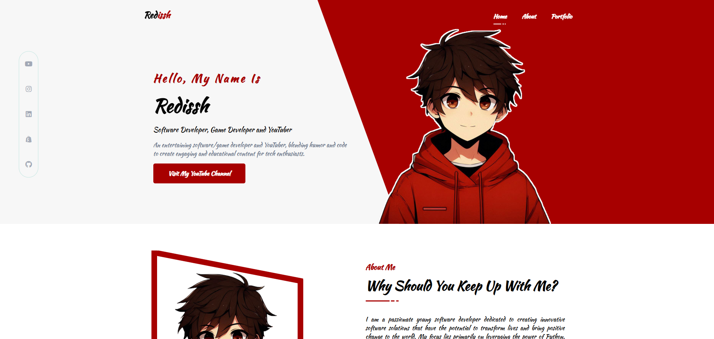

<h2 align="center">
  My Portfolio Website  
</h2>
 
 

(click the image)

This project was built using:

- HTML
- CSS
- JavaScript
- Visual Studio Code
- Github Pages

### Show your support

   

Give a ⭐ if you like this website!

